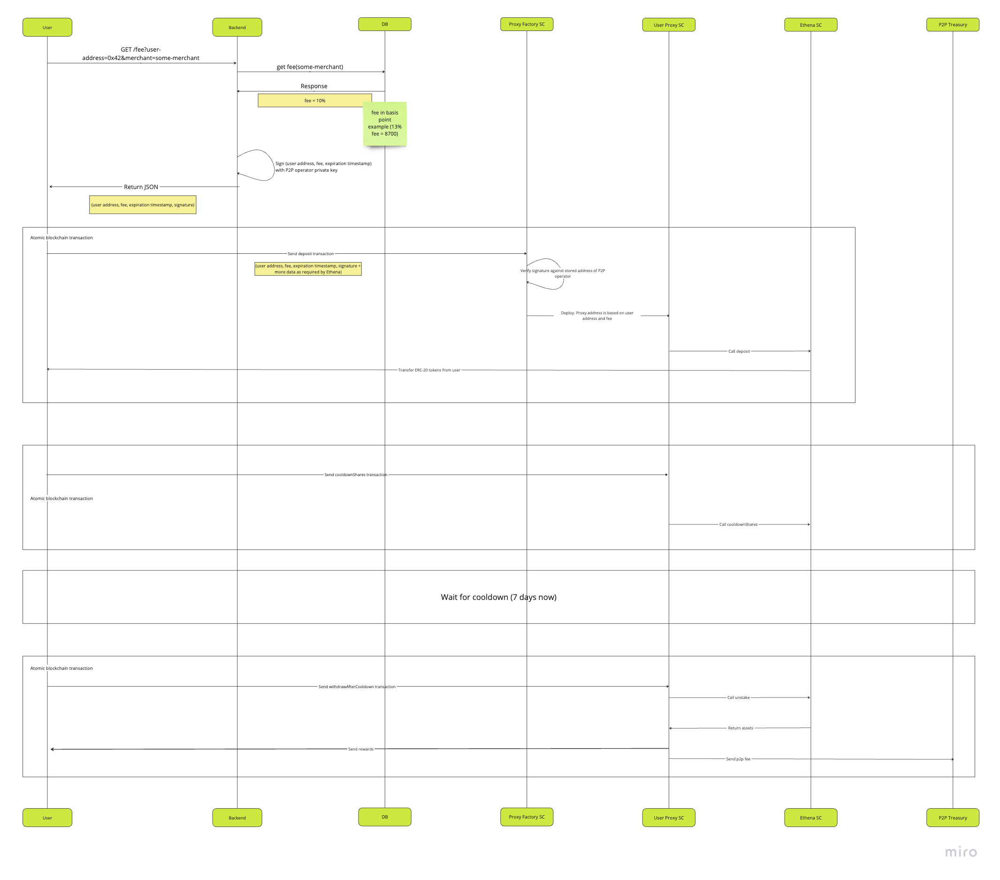

## p2p-yield-proxy

Contracts for depositing and withdrawing ERC-20 tokens from yield protocols.
The current implementation is only compatible with [Ethena](https://ethena.fi/) protocol. 

## Running tests

```shell
curl -L https://foundry.paradigm.xyz | bash
source /Users/$USER/.bashrc
foundryup
forge test
```

## Deployment

```shell
forge script script/DeployBase.s.sol:Deploy --rpc-url $RPC_URL --private-key $PRIVATE_KEY --broadcast --chain $CHAIN_ID --json --verify --etherscan-api-key $ETHERSCAN_API_KEY -vvvvv
```

This script will:

- deploy and verify on Etherscan the **P2pEthenaProxyFactory** and **P2pEthenaProxy** contracts
- set the **P2pTreasury** address permanently in the P2pEthenaProxyFactory
- set the rules for Ethena specific deposit and withdrawal functions

## Basic use case



#### Ethena Deposit flow

Look at [function _doDeposit()](test/BaseIntegrationMorpho.sol#L1000) for a reference implementation of the flow.

1. Website User (called Client in contracts) calls Backend with its (User's) Ethereum address and some Merchant info.

2. Backend uses Merchant info to determine the P2P fee (expressed as client basis points in the contracts).

3. Backend calls P2pEthenaProxyFactory's `getHashForP2pSigner` function to get the hash for the P2pSigner.

```solidity
    /// @dev Gets the hash for the P2pSigner
    /// @param _client The address of client
    /// @param _clientBasisPoints The client basis points
    /// @param _p2pSignerSigDeadline The P2pSigner signature deadline
    /// @return The hash for the P2pSigner
    function getHashForP2pSigner(
        address _client,
        uint96 _clientBasisPoints,
        uint256 _p2pSignerSigDeadline
    ) external view returns (bytes32);
```

4. Backend signs the hash with the P2pSigner's private key using `eth_sign`. Signing is necessary to authenticate the client basis points in the contracts.

5. Backend returns JSON to the User with (client address, client basis points, signature deadline, and the signature).

6. Client-side JS code prepares all the necessary data for the Morpho deposit function. Since the deposited tokens will first go from the client to the client's P2pEthenaProxy instance and then from the P2pEthenaProxy instance into the Ethena protocol, both of these transfers are approved by the client via Permit2. The client's P2pEthenaProxy instance address is fetched from the P2pEthenaProxyFactory contract's `predictP2pEthenaProxyAddress` function:

```solidity
    /// @dev Computes the address of a P2pEthenaProxy created by `_createP2pEthenaProxy` function
    /// @dev P2pEthenaProxy instances are guaranteed to have the same address if _feeDistributorInstance is the same
    /// @param _client The address of client
    /// @return address The address of the P2pEthenaProxy instance
    function predictP2pEthenaProxyAddress(
        address _client,
        uint96 _clientBasisPoints
    ) external view returns (address);
```

7. Client-side JS code checks if User has already approved the required amount of the deposited token for Permit2. If not, it prompts the User to call the `approve` function of the deposited token contract with the uint256 MAX value and Permit2 contract as the spender.

8. Client-side JS code prompts the User to do `eth_signTypedData_v4` to sign `PermitSingle` from the User's wallet into the P2pEthenaProxy instance

9. Client-side JS code prompts the User to call the `deposit` function of the P2pEthenaProxyFactory contract:

```solidity
    /// @dev Deposits the yield protocol
    /// @param _permitSingleForP2pEthenaProxy The permit single for P2pEthenaProxy
    /// @param _permit2SignatureForP2pEthenaProxy The permit2 signature for P2pEthenaProxy
    /// @param _clientBasisPoints The client basis points
    /// @param _p2pSignerSigDeadline The P2pSigner signature deadline
    /// @param _p2pSignerSignature The P2pSigner signature
    /// @return P2pEthenaProxyAddress The client's P2pEthenaProxy instance address
    function deposit(
        IAllowanceTransfer.PermitSingle memory _permitSingleForP2pEthenaProxy,
        bytes calldata _permit2SignatureForP2pEthenaProxy,

        uint96 _clientBasisPoints,
        uint256 _p2pSignerSigDeadline,
        bytes calldata _p2pSignerSignature
    )
    external
    returns (address P2pEthenaProxyAddress);
```

#### Ethena Withdrawal flow

Look at [function _doWithdraw()](test/BaseIntegrationMorpho.sol#L1024) for a reference implementation of the flow.

1. Client-side JS code prepares all the necessary data for the Ethena `cooldownShares` function.

2. Client-side JS code prompts the User to call the `cooldownShares` function of the client's instance of the P2pEthenaProxy contract:

```solidity
    /// @notice redeem shares into assets and starts a cooldown to claim the converted underlying asset
    /// @param _shares shares to redeem
    function cooldownShares(uint256 _shares) external returns (uint256 assets);
```

3. Wait for the [cooldownDuration](https://etherscan.io/address/0x9d39a5de30e57443bff2a8307a4256c8797a3497#readContract#F9). (Currently, 7 days).

2. Client-side JS code prompts the User to call the `withdrawAfterCooldown` function of the client's instance of the P2pEthenaProxy contract:

```solidity
    /// @notice withdraw assets after cooldown has elapsed
    function withdrawAfterCooldown() external;
```

The P2pEthenaProxy contract will redeem the tokens from Ethena and send them to User. The amount on top of the deposited amount is split between the User and the P2pTreasury according to the client basis points.


## Calling any function on any contracts via P2pEthenaProxy

It's possible for the User to call any function on any contracts via P2pEthenaProxy. This can be useful if it appears that functions of yield protocols beyond simple deposit and withdrawal are needed. Also, it can be useful for claiming any airdrops unknown in advance.

Before the User can use this feature, the P2P operator needs to set the rules for the function call via the `setCalldataRules` function of the P2pEthenaProxyFactory contract:

```solidity
    /// @dev Sets the calldata rules
    /// @param _contract The contract address
    /// @param _selector The selector
    /// @param _rules The rules
    function setCalldataRules(
        address _contract,
        bytes4 _selector,
        P2pStructs.Rule[] calldata _rules
    ) external;
```

The rules should be as strict as possible to prevent any undesired function calls.

Once the rules are set, the User can call the permitted function on the permitted contract with the permitted calldata via P2pEthenaProxy's `callAnyFunction` function:

```solidity
    /// @notice Calls an arbitrary allowed function
    /// @param _yieldProtocolAddress The address of the yield protocol
    /// @param _yieldProtocolCalldata The calldata to call the yield protocol
    function callAnyFunction(
        address _yieldProtocolAddress,
        bytes calldata _yieldProtocolCalldata
    )
    external;
```
