# P2P Yield Proxy

Contracts for depositing and withdrawing ERC-20 tokens from yield protocols via deterministic per-user proxies.
A single **P2pYieldProxyFactory** supports multiple protocol adapters simultaneously. Current adapters:

| Adapter | Protocols / Vaults | Assets |
|---------|--------------------|--------|
| **P2pErc4626Proxy** | Any standard ERC-4626 vault: MetaMorpho, Fluid fTokens, etc. | USDC, USDT, WETH, ... |
| **P2pAaveProxy** | Aave V3 Pool | USDC, USDT, WETH, ... (any Aave-listed asset) |
| **P2pSparkProxy** | SparkLend (Aave V3 fork) | USDC, USDT, WETH, ... (any Spark-listed asset) |
| **P2pCompoundProxy** | Compound V3 Comets | USDC, WETH, USDT (via CompoundMarketRegistry) |
| **P2pEthenaProxy** | sUSDe, sENA (StakedUSDeV2) | USDe, ENA |
| **P2pEulerProxy** | Euler V2 EVaults (via EVC) | USDC, USDT, WETH, ... |
| **P2pMapleProxy** | Maple Finance pools (FIFO queue) | USDC, USDT |
| **P2pResolvProxy** | stUSR, ResolvStaking | USR, RESOLV |

P2pAaveProxy and P2pSparkProxy share a common base class **P2pAaveLikeProxy** that contains all deposit/withdraw/accrual logic for Aave V3 and its forks.

New protocol adapters can be deployed and added to the factory at any time via `addReferenceP2pYieldProxy()` without redeploying existing infrastructure.

---

## Table of Contents

- [Architecture Overview](#architecture-overview)
- [Actors and Roles](#actors-and-roles)
- [Smart Contract Components](#smart-contract-components)
  - [P2pYieldProxyFactory](#p2pyieldproxyfactory)
  - [P2pYieldProxy (Base)](#p2pyieldproxy-base)
  - [AllowedCalldataChecker (Dual-Checker Pattern)](#allowedcalldatachecker-dual-checker-pattern)
  - [Protocol Adapters](#protocol-adapters)
- [User Stories and Use Cases](#user-stories-and-use-cases)
- [Deposit Flow](#deposit-flow)
- [Withdrawal Flow](#withdrawal-flow)
- [Fee Split and Accounting](#fee-split-and-accounting)
- [Additional Reward Claiming](#additional-reward-claiming)
- [Calling Arbitrary Functions via Proxy](#calling-arbitrary-functions-via-proxy)
- [Protocol-Specific Details](#protocol-specific-details)
  - [Resolv (USR / RESOLV)](#resolv-usr--resolv)
  - [Ethena (USDe / ENA)](#ethena-usde--ena)
  - [Aave V3 / SparkLend](#aave-v3--sparklend)
  - [Compound V3](#compound-v3)
  - [ERC-4626 (MetaMorpho, Fluid, etc.)](#erc-4626-metamorpho-fluid-etc)
  - [Euler V2](#euler-v2)
  - [Maple Finance](#maple-finance)
- [Invariants and Assumptions](#invariants-and-assumptions)
- [Edge Cases](#edge-cases)
- [Running Tests](#running-tests)
- [Deployment](#deployment)

---

## Architecture Overview


```mermaid
graph TB
    subgraph "Off-chain"
        USER["Client (Website User)"]
        BACKEND["P2P Backend"]
        DB["Database"]
    end

    subgraph "On-chain — Factory"
        FACTORY["P2pYieldProxyFactory"]
    end

    subgraph "On-chain — Reference Proxies (templates)"
        REF_ERC4626["P2pErc4626Proxy (ref)"]
        REF_AAVE["P2pAaveProxy (ref)"]
        REF_SPARK["P2pSparkProxy (ref)"]
        REF_COMPOUND["P2pCompoundProxy (ref)"]
        REF_ETHENA["P2pEthenaProxy (ref)"]
        REF_EULER["P2pEulerProxy (ref)"]
        REF_MAPLE["P2pMapleProxy (ref)"]
        REF_RESOLV["P2pResolvProxy (ref)"]
        REF_FUTURE["Future Adapter (ref)"]
    end

    subgraph "On-chain — Per-User Clones (ERC-1167)"
        CLONE1["Clone: Aave USDC\n(client=Alice, bp=9000)"]
        CLONE2["Clone: Ethena USDe\n(client=Alice, bp=9000)"]
        CLONE3["Clone: Resolv USR\n(client=Bob, bp=8500)"]
    end

    subgraph "On-chain — Yield Protocols"
        ERC4626_VAULT["MetaMorpho / Fluid / etc."]
        AAVE["Aave V3 Pool"]
        SPARK["SparkLend Pool"]
        COMPOUND["Compound V3 Comet"]
        ETHENA["sUSDe / sENA"]
        EULER["Euler V2 EVault"]
        MAPLE["Maple Pool"]
        RESOLV["stUSR / ResolvStaking"]
    end

    TREASURY["P2pTreasury"]

    USER -->|"1. Request fee quote"| BACKEND
    BACKEND -->|"2. Store merchant info"| DB
    BACKEND -->|"3. getHashForP2pSigner()"| FACTORY
    BACKEND -->|"4. Return signed params"| USER
    USER -->|"5. approve() asset"| CLONE1
    USER -->|"6. deposit()"| FACTORY
    FACTORY -->|"7. Clone or reuse"| CLONE1
    FACTORY -->|"7. Clone or reuse"| CLONE2
    FACTORY -->|"7. Clone or reuse"| CLONE3
    CLONE1 -->|"8. Supply"| AAVE
    CLONE2 -->|"8. Deposit"| ETHENA
    CLONE3 -->|"8. Deposit"| RESOLV

    FACTORY -.->|"addReferenceP2pYieldProxy()"| REF_ERC4626
    FACTORY -.->|"addReferenceP2pYieldProxy()"| REF_AAVE
    FACTORY -.->|"addReferenceP2pYieldProxy()"| REF_SPARK
    FACTORY -.->|"addReferenceP2pYieldProxy()"| REF_COMPOUND
    FACTORY -.->|"addReferenceP2pYieldProxy()"| REF_ETHENA
    FACTORY -.->|"addReferenceP2pYieldProxy()"| REF_EULER
    FACTORY -.->|"addReferenceP2pYieldProxy()"| REF_MAPLE
    FACTORY -.->|"addReferenceP2pYieldProxy()"| REF_RESOLV
    FACTORY -.->|"addReferenceP2pYieldProxy()"| REF_FUTURE

    CLONE1 -->|"Fee on profit"| TREASURY
    CLONE2 -->|"Fee on profit"| TREASURY
    CLONE3 -->|"Fee on profit"| TREASURY
```

### ERC-1167 Minimal Proxy (Clone) Pattern

Each user gets a deterministic proxy per (referenceProxy, client, clientBasisPoints) tuple. Proxies are created using OpenZeppelin `Clones.cloneDeterministic()`:

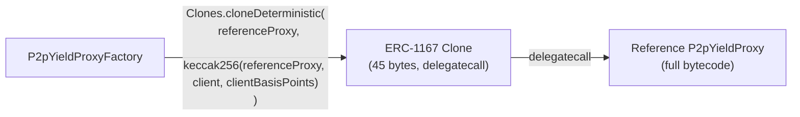
```mermaid
graph LR
    FACTORY["P2pYieldProxyFactory"]
    REF["Reference P2pYieldProxy\n(full bytecode)"]
    CLONE["ERC-1167 Clone\n(45 bytes, delegatecall)"]

    FACTORY -->|"Clones.cloneDeterministic(\n  referenceProxy,\n  keccak256(referenceProxy, client, clientBasisPoints)\n)"| CLONE
    CLONE -->|"delegatecall"| REF
```

The clone's address is deterministic and can be predicted before creation:

```solidity
function predictP2pYieldProxyAddress(
    address _referenceP2pYieldProxy,
    address _client,
    uint96 _clientBasisPoints
) external view returns (address proxyAddress);
```

---

## Actors and Roles


```mermaid
graph TD
    subgraph "Actors"
        CLIENT["Client\n(end user / depositor)"]
        OPERATOR["P2P Operator\n(protocol admin)"]
        SIGNER["P2P Signer\n(fee authenticator)"]
        TREASURY_ADDR["P2P Treasury\n(fee recipient)"]
    end

    subgraph "Privileges"
        direction LR
        C1["Deposit via factory"]
        C2["Withdraw principal + profit"]
        C3["callAnyFunction (client side)"]
        C4["claimAdditionalRewardTokens"]
        O1["withdrawAccruedRewards"]
        O2["callAnyFunctionByP2pOperator"]
        O3["claimAdditionalRewardTokens"]
        O4["addReferenceP2pYieldProxy"]
        O5["transferP2pSigner"]
        O6["Configure AllowedCalldataChecker rules"]
        S1["Sign (client, clientBasisPoints, deadline)"]
    end

    CLIENT --> C1
    CLIENT --> C2
    CLIENT --> C3
    CLIENT --> C4
    OPERATOR --> O1
    OPERATOR --> O2
    OPERATOR --> O3
    OPERATOR --> O4
    OPERATOR --> O5
    OPERATOR --> O6
    SIGNER --> S1
```

| Actor | Description |
|-------|-------------|
| **Client** | The end user who deposits assets and earns yield. Owns the principal. Can withdraw at any time. |
| **P2P Operator** | Manages the factory: adds reference proxies, sets calldata rules, transfers signer. Can sweep accrued rewards from proxies. Two-step transfer (`transferP2pOperator` / `acceptP2pOperator`). |
| **P2P Signer** | Off-chain key that signs `(referenceProxy, client, clientBasisPoints, deadline)` to authenticate the fee split for each deposit. |
| **P2P Treasury** | Immutable address set per reference proxy. Receives the P2P share of yield and reward fees. |

---

## Smart Contract Components

### P2pYieldProxyFactory

The single entry point for all deposits across all protocols.

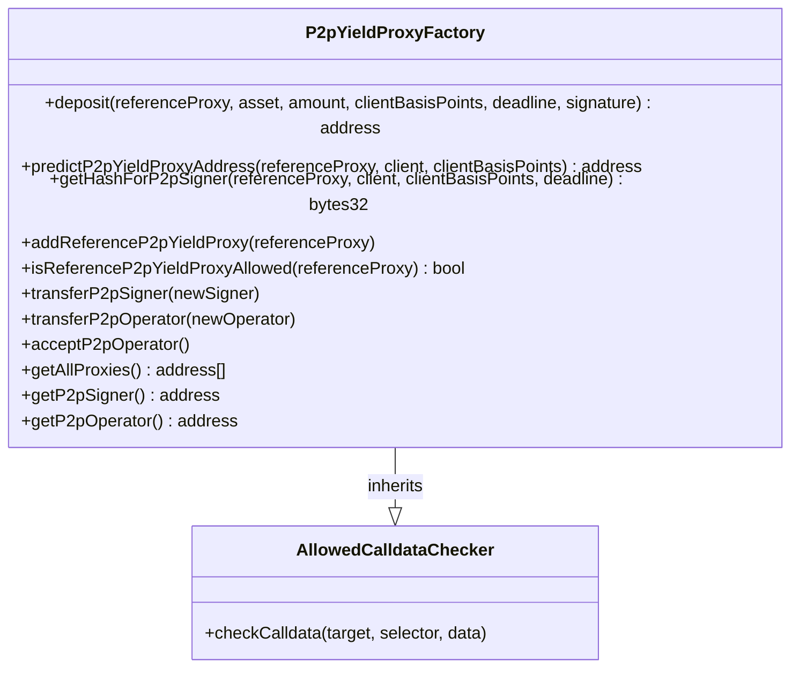
```mermaid
classDiagram
    class P2pYieldProxyFactory {
        +deposit(referenceProxy, asset, amount, clientBasisPoints, deadline, signature) address
        +predictP2pYieldProxyAddress(referenceProxy, client, clientBasisPoints) address
        +getHashForP2pSigner(referenceProxy, client, clientBasisPoints, deadline) bytes32
        +addReferenceP2pYieldProxy(referenceProxy)
        +isReferenceP2pYieldProxyAllowed(referenceProxy) bool
        +transferP2pSigner(newSigner)
        +transferP2pOperator(newOperator)
        +acceptP2pOperator()
        +getAllProxies() address[]
        +getP2pSigner() address
        +getP2pOperator() address
    }

    class AllowedCalldataChecker {
        +checkCalldata(target, selector, data)
    }

    P2pYieldProxyFactory --|> AllowedCalldataChecker : inherits
```

**Key behaviors:**
- Validates the P2P signer signature on every `deposit()` call
- Creates a new ERC-1167 clone on first deposit, reuses on subsequent deposits
- The same factory instance handles all protocol adapters simultaneously
- Only `p2pOperator` can add new reference proxies or transfer the signer

### P2pYieldProxy (Base)

Abstract base contract inherited by all protocol adapters.

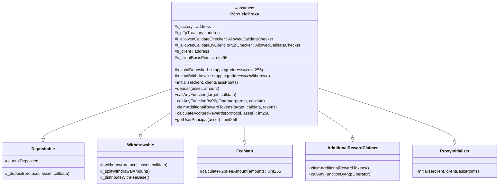
```mermaid
classDiagram
    class P2pYieldProxy {
        <<abstract>>
        #i_factory : address
        #i_p2pTreasury : address
        #i_allowedCalldataChecker : AllowedCalldataChecker
        #i_allowedCalldataByClientToP2pChecker : AllowedCalldataChecker
        #s_client : address
        #s_clientBasisPoints : uint96
        #s_totalDeposited : mapping(address=>uint256)
        #s_totalWithdrawn : mapping(address=>Withdrawn)
        +initialize(client, clientBasisPoints)
        +deposit(asset, amount)
        +callAnyFunction(target, calldata)
        +callAnyFunctionByP2pOperator(target, calldata)
        +claimAdditionalRewardTokens(target, calldata, tokens)
        +calculateAccruedRewards(protocol, asset) int256
        +getUserPrincipal(asset) uint256
    }

    class Depositable {
        #_deposit(protocol, asset, calldata)
        #s_totalDeposited
    }

    class Withdrawable {
        #_withdraw(protocol, asset, calldata)
        #_splitWithdrawalAmount()
        #_distributeWithFeeBase()
    }

    class FeeMath {
        #calculateP2pFeeAmount(amount) uint256
    }

    class AdditionalRewardClaimer {
        +claimAdditionalRewardTokens()
        +callAnyFunctionByP2pOperator()
    }

    class ProxyInitializer {
        +initialize(client, clientBasisPoints)
    }

    P2pYieldProxy --|> Depositable
    P2pYieldProxy --|> Withdrawable
    P2pYieldProxy --|> FeeMath
    P2pYieldProxy --|> AdditionalRewardClaimer
    P2pYieldProxy --|> ProxyInitializer
```

**Inheritance chains:**

```
P2pErc4626Proxy → P2pYieldProxy → ...

P2pAaveProxy  → P2pAaveLikeProxy → P2pYieldProxy → ...
P2pSparkProxy → P2pAaveLikeProxy → P2pYieldProxy → ...

P2pCompoundProxy → P2pYieldProxy → ...
P2pEthenaProxy   → P2pYieldProxy → ...
P2pEulerProxy    → P2pYieldProxy → ...
P2pMapleProxy    → P2pYieldProxy → ...
P2pResolvProxy   → P2pYieldProxy → ...

P2pYieldProxy → Withdrawable → Depositable → FeeMath
              → AdditionalRewardClaimer
              → AnyFunctionWithCalldataChecker
              → AllowedCalldataByClientToP2pCheckerImmutable
              → ProxyInitializer
              → FactoryImmutable
              → AccruedRewardsWithTreasury
              → ERC165
```

### AllowedCalldataChecker (Dual-Checker Pattern)

Each proxy has **two** calldata checkers, both upgradeable proxies themselves:

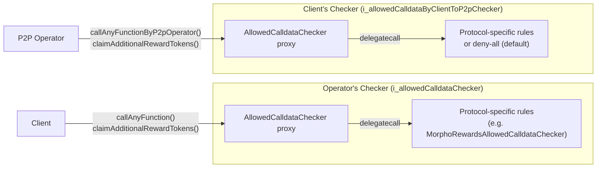
```mermaid
graph LR
    subgraph "Operator's Checker (i_allowedCalldataChecker)"
        OC["AllowedCalldataChecker proxy"]
        OC_IMPL["Protocol-specific rules\n(e.g. MorphoRewardsAllowedCalldataChecker)"]
        OC -->|"delegatecall"| OC_IMPL
    end

    subgraph "Client's Checker (i_allowedCalldataByClientToP2pChecker)"
        CC["AllowedCalldataChecker proxy"]
        CC_IMPL["Protocol-specific rules\nor deny-all (default)"]
        CC -->|"delegatecall"| CC_IMPL
    end

    CLIENT["Client"] -->|"callAnyFunction()\nclaimAdditionalRewardTokens()"| OC
    OPERATOR["P2P Operator"] -->|"callAnyFunctionByP2pOperator()\nclaimAdditionalRewardTokens()"| CC
```

| Checker | Controls | Managed by | Purpose |
|---------|----------|------------|---------|
| `i_allowedCalldataChecker` | What the **client** can call via `callAnyFunction` and `claimAdditionalRewardTokens` | P2P Operator | Whitelist safe protocol interactions for clients |
| `i_allowedCalldataByClientToP2pChecker` | What the **operator** can call via `callAnyFunctionByP2pOperator` and `claimAdditionalRewardTokens` | Client (or operator on their behalf) | Allow operator to claim rewards, sweep tokens, etc. |

Both start as deny-all (`AllowedCalldataChecker` base with no rules). The operator upgrades the checker implementation to protocol-specific rules (e.g., `MorphoRewardsAllowedCalldataChecker` for Morpho URD/Merkl claims).

### Protocol Adapters

Each adapter extends `P2pYieldProxy` with protocol-specific deposit, withdraw, and reward logic:


```mermaid
classDiagram
    class P2pYieldProxy {
        <<abstract>>
    }

    class P2pErc4626Proxy {
        +deposit(vault, amount)
        +withdraw(vault, shares)
        +withdrawAccruedRewards(vault)
        +calculateAccruedRewards(vault, asset) int256
    }

    class P2pAaveLikeProxy {
        <<abstract>>
        #i_pool : IAaveV3Pool
        #i_dataProvider : IAaveProtocolDataProvider
        #_depositToPool(asset, amount)
        #_withdrawFromPool(asset, amount)
        #_withdrawAccruedFromPool(asset, accrued)
        +calculateAccruedRewards(_, asset) int256
        +getYieldToken(asset) address
    }

    class P2pAaveProxy {
        +deposit(asset, amount)
        +withdraw(asset, amount)
        +withdrawAccruedRewards(asset)
        +getAToken(asset) address
        +getAavePool() address
    }

    class P2pSparkProxy {
        +deposit(asset, amount)
        +withdraw(asset, amount)
        +withdrawAccruedRewards(asset)
        +getSpToken(asset) address
        +getSparkPool() address
    }

    class P2pCompoundProxy {
        +i_cometRewards : address
        +i_marketRegistry : CompoundMarketRegistry
        +deposit(asset, amount)
        +withdraw(asset, amount)
        +withdrawAccruedRewards(asset)
        +getComet(asset) address
    }

    class P2pEthenaProxy {
        +i_stakedUSDe : address
        +i_USDe : address
        +s_assetsCoolingDown : uint256
        +cooldownAssets(assets) shares
        +cooldownShares(shares) assets
        +cooldownAssetsAccruedRewards() shares
        +withdrawAfterCooldown()
        +withdrawAfterCooldownAccruedRewards()
        +withdrawWithoutCooldown(assets)
        +redeemWithoutCooldown(shares)
    }

    class P2pEulerProxy {
        +i_evc : IEVC
        +deposit(vault, amount)
        +withdraw(vault, shares)
        +withdrawAccruedRewards(vault)
        +claimRewardStreams(vault, reward)
        +enableBalanceForwarder(vault)
        +enableReward(vault, reward)
    }

    class P2pMapleProxy {
        +deposit(pool, amount)
        +withdraw(pool, shares)
        +withdrawAccruedRewards(pool)
        +requestRedeem(pool, shares)
        +requestRedeemAccruedRewards(pool)
        +removeShares(pool, shares)
    }

    class P2pResolvProxy {
        +i_stUSR : address
        +i_resolvStaking : address
        +i_USR : address
        +i_RESOLV : address
        +withdrawUSR(amount)
        +withdrawAllUSR()
        +initiateWithdrawalRESOLV(amount)
        +withdrawRESOLV()
        +claimStakedTokenDistributor(index, amount, proof)
        +claimRewardTokens()
        +sweepRewardToken(token)
    }

    P2pYieldProxy <|-- P2pErc4626Proxy
    P2pYieldProxy <|-- P2pAaveLikeProxy
    P2pAaveLikeProxy <|-- P2pAaveProxy
    P2pAaveLikeProxy <|-- P2pSparkProxy
    P2pYieldProxy <|-- P2pCompoundProxy
    P2pYieldProxy <|-- P2pEthenaProxy
    P2pYieldProxy <|-- P2pEulerProxy
    P2pYieldProxy <|-- P2pMapleProxy
    P2pYieldProxy <|-- P2pResolvProxy
```

---

## User Stories and Use Cases

### UC1: Client deposits into a yield protocol

A website user wants to earn yield on their USDC via Aave. They:
1. Get a fee quote from the P2P backend
2. Receive a signed authorization
3. Approve the proxy address for their USDC
4. Call `factory.deposit()` — the factory creates their proxy clone and forwards funds to Aave

### UC2: Client withdraws principal + profit

The client calls the adapter-specific withdraw method (e.g., `P2pAaveProxy.withdraw(USDC, amount)`). The proxy:
1. Redeems from the yield protocol
2. Splits the withdrawn amount into **principal** (100% to client) and **profit** (split per `clientBasisPoints`)
3. Transfers the P2P fee share to treasury, remainder to client

### UC3: P2P operator sweeps accrued rewards

The operator periodically calls `withdrawAccruedRewards(asset)` to collect the P2P share of yield that has accumulated. The same profit split applies.

### UC4: Claiming additional reward tokens (airdrops, incentives)

Both client and operator can call `claimAdditionalRewardTokens()` to claim external rewards (e.g., COMP from Compound, Morpho URD/Merkl rewards). The claimed tokens are split per `clientBasisPoints`. The calldata is validated by the appropriate `AllowedCalldataChecker`.

### UC5: Adding a new protocol adapter

The operator deploys a new reference proxy (e.g., `P2pNewProtocolProxy`) and calls `factory.addReferenceP2pYieldProxy(newProxy)`. Immediately, all clients can deposit into the new protocol through the same factory.

---

## Deposit Flow

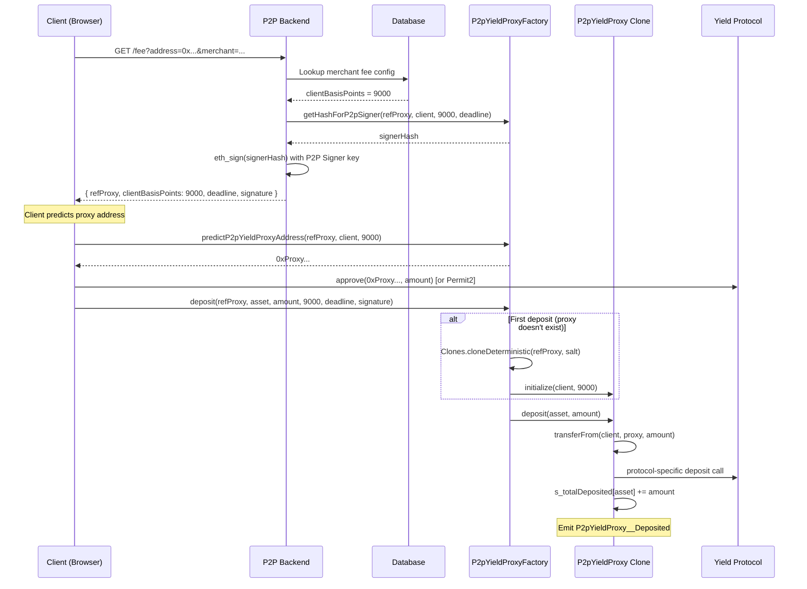
```mermaid
sequenceDiagram
    participant User as Client (Browser)
    participant Backend as P2P Backend
    participant DB as Database
    participant Factory as P2pYieldProxyFactory
    participant Proxy as P2pYieldProxy Clone
    participant Protocol as Yield Protocol

    User->>Backend: GET /fee?address=0x...&merchant=...
    Backend->>DB: Lookup merchant fee config
    DB-->>Backend: clientBasisPoints = 9000

    Backend->>Factory: getHashForP2pSigner(refProxy, client, 9000, deadline)
    Factory-->>Backend: signerHash

    Backend->>Backend: eth_sign(signerHash) with P2P Signer key

    Backend-->>User: { refProxy, clientBasisPoints: 9000, deadline, signature }

    Note over User: Client predicts proxy address
    User->>Factory: predictP2pYieldProxyAddress(refProxy, client, 9000)
    Factory-->>User: 0xProxy...

    User->>Protocol: approve(0xProxy..., amount)  [or Permit2]

    User->>Factory: deposit(refProxy, asset, amount, 9000, deadline, signature)

    alt First deposit (proxy doesn't exist)
        Factory->>Factory: Clones.cloneDeterministic(refProxy, salt)
        Factory->>Proxy: initialize(client, 9000)
    end

    Factory->>Proxy: deposit(asset, amount)
    Proxy->>Proxy: transferFrom(client, proxy, amount)
    Proxy->>Protocol: protocol-specific deposit call
    Proxy->>Proxy: s_totalDeposited[asset] += amount

    Note over Proxy: Emit P2pYieldProxy__Deposited
```

**Factory `deposit` signature:**

```solidity
function deposit(
    address _referenceP2pYieldProxy,
    address _asset,
    uint256 _amount,
    uint96 _clientBasisPoints,
    uint256 _p2pSignerSigDeadline,
    bytes calldata _p2pSignerSignature
) external returns (address p2pYieldProxyAddress);
```

**Factory `getHashForP2pSigner` signature:**

```solidity
function getHashForP2pSigner(
    address _referenceP2pYieldProxy,
    address _client,
    uint96 _clientBasisPoints,
    uint256 _p2pSignerSigDeadline
) external view returns (bytes32 signerHash);
```

---

## Withdrawal Flow

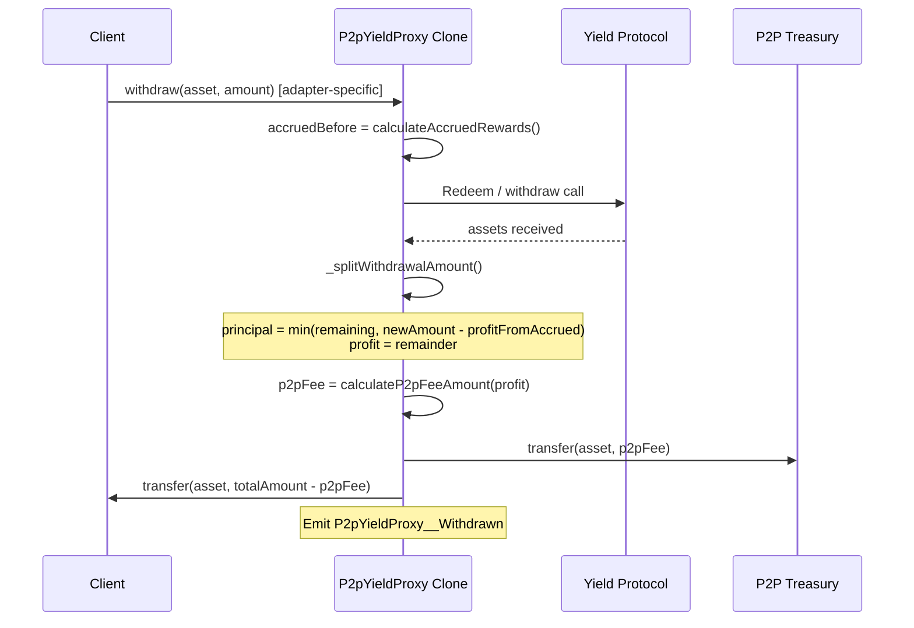
```mermaid
sequenceDiagram
    participant Client
    participant Proxy as P2pYieldProxy Clone
    participant Protocol as Yield Protocol
    participant Treasury as P2P Treasury

    Client->>Proxy: withdraw(asset, amount)  [adapter-specific]

    Proxy->>Proxy: accruedBefore = calculateAccruedRewards()
    Proxy->>Protocol: Redeem / withdraw call
    Protocol-->>Proxy: assets received

    Proxy->>Proxy: _splitWithdrawalAmount()
    Note over Proxy: principal = min(remaining, newAmount - profitFromAccrued)<br/>profit = remainder

    Proxy->>Proxy: p2pFee = calculateP2pFeeAmount(profit)
    Proxy->>Treasury: transfer(asset, p2pFee)
    Proxy->>Client: transfer(asset, totalAmount - p2pFee)

    Note over Proxy: Emit P2pYieldProxy__Withdrawn
```

### Operator Accrued Rewards Sweep

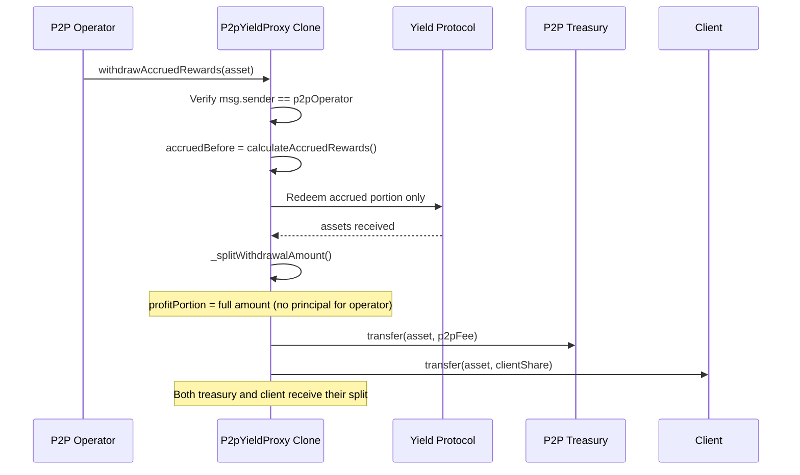
```mermaid
sequenceDiagram
    participant Operator as P2P Operator
    participant Proxy as P2pYieldProxy Clone
    participant Protocol as Yield Protocol
    participant Treasury as P2P Treasury
    participant Client

    Operator->>Proxy: withdrawAccruedRewards(asset)
    Proxy->>Proxy: Verify msg.sender == p2pOperator
    Proxy->>Proxy: accruedBefore = calculateAccruedRewards()
    Proxy->>Protocol: Redeem accrued portion only
    Protocol-->>Proxy: assets received

    Proxy->>Proxy: _splitWithdrawalAmount()
    Note over Proxy: profitPortion = full amount (no principal for operator)

    Proxy->>Treasury: transfer(asset, p2pFee)
    Proxy->>Client: transfer(asset, clientShare)

    Note over Proxy: Both treasury and client receive their split
```

---

## Fee Split and Accounting

### Fee Calculation

```solidity
// FeeMath.sol
function calculateP2pFeeAmount(uint256 _amount) internal view returns (uint256) {
    if (_amount == 0) return 0;
    return (_amount * (10_000 - s_clientBasisPoints) + 9999) / 10_000; // ceiling division
}
```

Example with `clientBasisPoints = 9000` (client keeps 90%):
- Profit = 1000 USDC
- P2P fee = (1000 * (10000 - 9000) + 9999) / 10000 = (1000 * 1000 + 9999) / 10000 = **100 USDC** (ceiling)
- Client share = 1000 - 100 = **900 USDC**

### Principal vs Profit Split

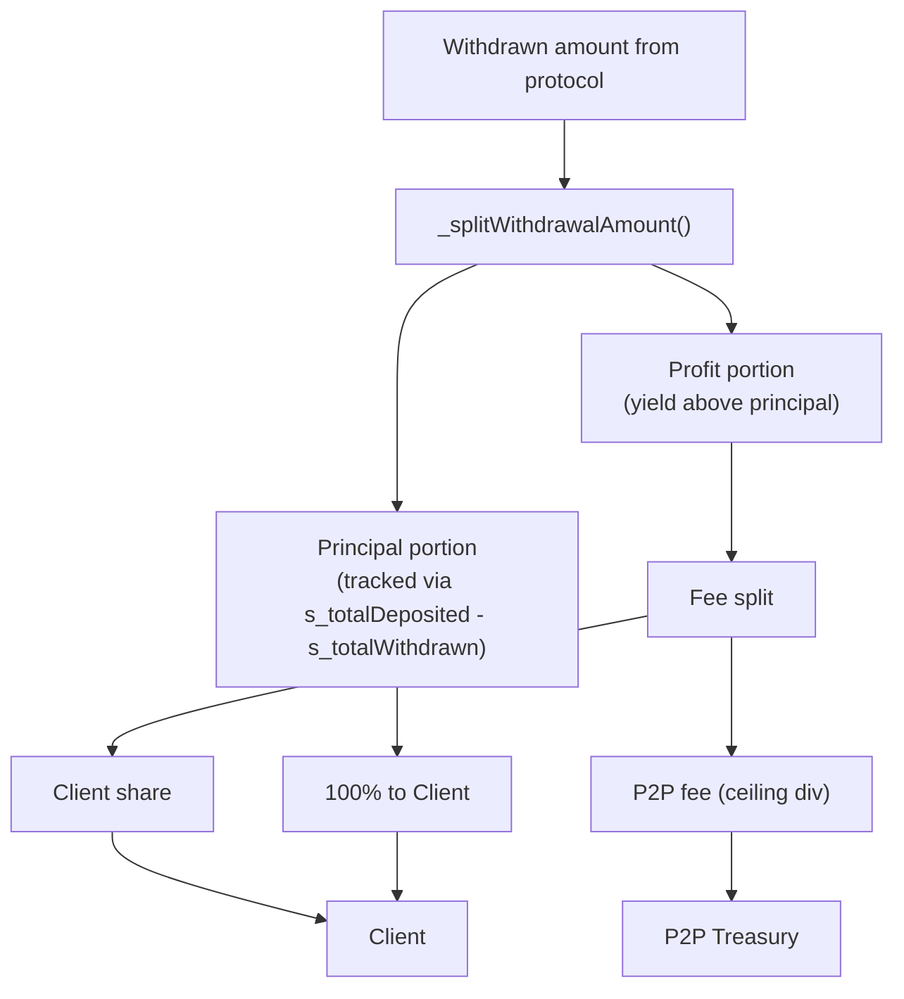
```mermaid
graph TD
    WITHDRAWN["Withdrawn amount from protocol"]
    SPLIT["_splitWithdrawalAmount()"]
    PRINCIPAL["Principal portion\n(tracked via s_totalDeposited - s_totalWithdrawn)"]
    PROFIT["Profit portion\n(yield above principal)"]
    CLIENT_P["100% to Client"]
    FEE_SPLIT["Fee split"]
    P2P_FEE["P2P fee (ceiling div)"]
    CLIENT_SHARE["Client share"]
    TREASURY["P2P Treasury"]
    CLIENT_FINAL["Client"]

    WITHDRAWN --> SPLIT
    SPLIT --> PRINCIPAL
    SPLIT --> PROFIT
    PRINCIPAL --> CLIENT_P
    PROFIT --> FEE_SPLIT
    FEE_SPLIT --> P2P_FEE --> TREASURY
    FEE_SPLIT --> CLIENT_SHARE --> CLIENT_FINAL
    CLIENT_P --> CLIENT_FINAL
```

**Key rule:** Principal is **never** fee-split. Only profit (yield above the deposited amount) is subject to the fee. The proxy tracks `s_totalDeposited[asset]` and `s_totalWithdrawn[asset]` to distinguish principal from profit on each withdrawal.

### Closing Withdrawal

When the client withdraws and `totalWithdrawn + newAmount >= totalDeposited`, it's a "closing withdrawal." In this case:
- `principalPortion = min(newAmount, remainingPrincipal)`
- `profitPortion = newAmount - principalPortion`

This ensures all remaining principal goes to the client fee-free.

---

## Additional Reward Claiming

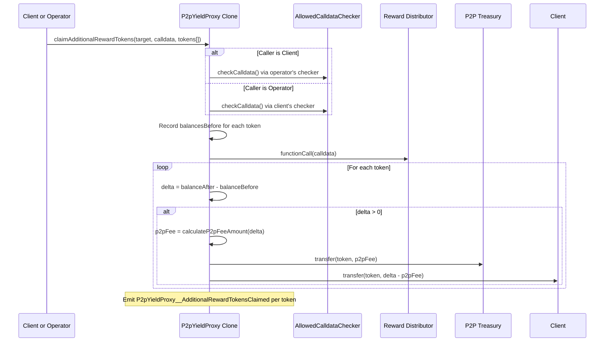
```mermaid
sequenceDiagram
    participant Caller as Client or Operator
    participant Proxy as P2pYieldProxy Clone
    participant Checker as AllowedCalldataChecker
    participant Distributor as Reward Distributor
    participant Treasury as P2P Treasury
    participant Client

    Caller->>Proxy: claimAdditionalRewardTokens(target, calldata, tokens[])

    alt Caller is Client
        Proxy->>Checker: checkCalldata() via operator's checker
    else Caller is Operator
        Proxy->>Checker: checkCalldata() via client's checker
    end

    Proxy->>Proxy: Record balancesBefore for each token

    Proxy->>Distributor: functionCall(calldata)

    loop For each token
        Proxy->>Proxy: delta = balanceAfter - balanceBefore
        alt delta > 0
            Proxy->>Proxy: p2pFee = calculateP2pFeeAmount(delta)
            Proxy->>Treasury: transfer(token, p2pFee)
            Proxy->>Client: transfer(token, delta - p2pFee)
        end
    end

    Note over Proxy: Emit P2pYieldProxy__AdditionalRewardTokensClaimed per token
```

**Access rule:** `claimAdditionalRewardTokens` can be called by **either** client or operator. The caller's action is validated against the **other party's** checker:
- Client calls → validated by `i_allowedCalldataChecker` (operator's)
- Operator calls → validated by `i_allowedCalldataByClientToP2pChecker` (client's)

This ensures mutual consent: neither party can claim without the other having whitelisted the action.

---

## Calling Arbitrary Functions via Proxy

Two methods exist for calling arbitrary functions through the proxy, each gated by a different checker:

| Method | Caller | Checker | Use case |
|--------|--------|---------|----------|
| `callAnyFunction(target, calldata)` | Client | Operator's checker | Client interacts with protocol features |
| `callAnyFunctionByP2pOperator(target, calldata)` | Operator only | Client's checker | Operator performs maintenance |

```solidity
function callAnyFunction(
    address _yieldProtocolAddress,
    bytes calldata _yieldProtocolCalldata
) external;

function callAnyFunctionByP2pOperator(
    address _target,
    bytes calldata _callData
) external; // onlyP2pOperator
```

The `AllowedCalldataChecker` rules must be configured to whitelist the target address + function selector before these calls succeed. Rules should be as strict as possible to prevent unintended function calls.

---

## Protocol-Specific Details

### Resolv (USR / RESOLV)

See [test/RESOLVIntegration.sol](test/RESOLVIntegration.sol) for an end-to-end reference.

**Supported assets and targets:**
- **USR** → deposited into `stUSR` via `IStUSR.deposit()`
- **RESOLV** → deposited into `ResolvStaking` via `IResolvStaking.deposit()`

**Withdrawal methods:**

| Method | Caller | Description |
|--------|--------|-------------|
| `withdrawUSR(amount)` | Client | Instant redeem from stUSR, profit split |
| `withdrawAllUSR()` | Client | Redeem entire stUSR balance |
| `initiateWithdrawalRESOLV(amount)` | Client | Queue delayed RESOLV unstake |
| `withdrawRESOLV()` | Client or Operator | Complete pending RESOLV withdrawal after cooldown |
| `initiateWithdrawalRESOLVAccruedRewards()` | Operator | Queue only the accrued rewards portion |
| `claimStakedTokenDistributor(index, amount, proof)` | Client or Operator | Claim Merkle-based distributor rewards |
| `claimRewardTokens()` | Client or Operator | Claim staking reward tokens, split per fee |
| `sweepRewardToken(token)` | Client | Sweep accumulated reward tokens to client |

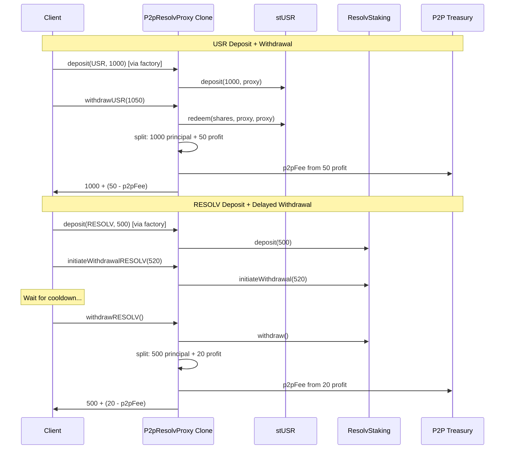
```mermaid
sequenceDiagram
    participant Client
    participant Proxy as P2pResolvProxy Clone
    participant StUSR as stUSR
    participant Staking as ResolvStaking
    participant Treasury as P2P Treasury

    Note over Client,Treasury: USR Deposit + Withdrawal
    Client->>Proxy: deposit(USR, 1000) [via factory]
    Proxy->>StUSR: deposit(1000, proxy)

    Client->>Proxy: withdrawUSR(1050)
    Proxy->>StUSR: redeem(shares, proxy, proxy)
    Proxy->>Proxy: split: 1000 principal + 50 profit
    Proxy->>Treasury: p2pFee from 50 profit
    Proxy->>Client: 1000 + (50 - p2pFee)

    Note over Client,Treasury: RESOLV Deposit + Delayed Withdrawal
    Client->>Proxy: deposit(RESOLV, 500) [via factory]
    Proxy->>Staking: deposit(500)

    Client->>Proxy: initiateWithdrawalRESOLV(520)
    Proxy->>Staking: initiateWithdrawal(520)

    Note over Client: Wait for cooldown...

    Client->>Proxy: withdrawRESOLV()
    Proxy->>Staking: withdraw()
    Proxy->>Proxy: split: 500 principal + 20 profit
    Proxy->>Treasury: p2pFee from 20 profit
    Proxy->>Client: 500 + (20 - p2pFee)
```

### Ethena (USDe / ENA)

Two reference proxies can be deployed — one with `(stakedUSDe=sUSDe, USDe=USDe)` and another with `(stakedUSDe=sENA, USDe=ENA)` — both using the same `P2pEthenaProxy` code.

**Key addresses:**
- USDe: `0x4c9EDD5852cd905f086C759E8383e09bff1E68B3`
- sUSDe: `0x9D39A5DE30e57443BfF2A8307A4256c8797A3497`
- ENA: `0x57e114B691Db790C35207b2e685D4A43181e6061`
- sENA: `0x8bE3460A480c80728a8C4D7a5D5303c85ba7B3b9`

Both sUSDe and sENA implement `StakedUSDeV2` with a 7-day cooldown (604800 seconds). When cooldown is active, ERC-4626 `withdraw()`/`redeem()` revert — only the cooldown-based flow works.

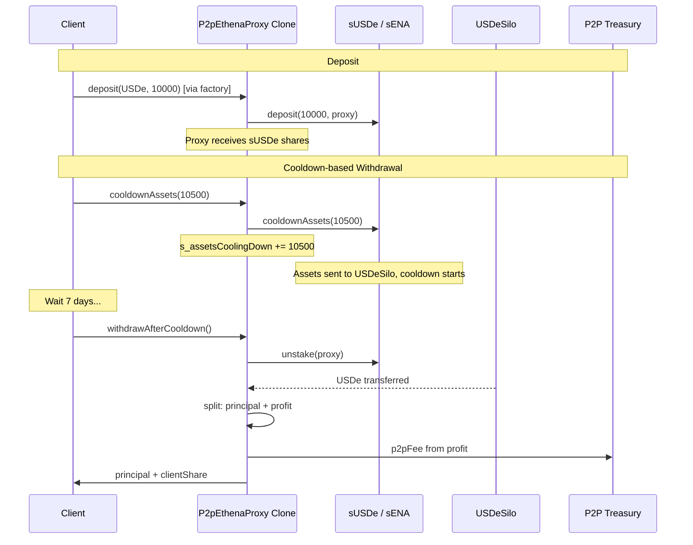
```mermaid
sequenceDiagram
    participant Client
    participant Proxy as P2pEthenaProxy Clone
    participant sUSDe as sUSDe / sENA
    participant Silo as USDeSilo
    participant Treasury as P2P Treasury

    Note over Client,Treasury: Deposit
    Client->>Proxy: deposit(USDe, 10000) [via factory]
    Proxy->>sUSDe: deposit(10000, proxy)
    Note over Proxy: Proxy receives sUSDe shares

    Note over Client,Treasury: Cooldown-based Withdrawal
    Client->>Proxy: cooldownAssets(10500)
    Proxy->>sUSDe: cooldownAssets(10500)
    Note over Proxy: s_assetsCoolingDown += 10500
    Note over sUSDe: Assets sent to USDeSilo, cooldown starts

    Note over Client: Wait 7 days...

    Client->>Proxy: withdrawAfterCooldown()
    Proxy->>sUSDe: unstake(proxy)
    Silo-->>Proxy: USDe transferred
    Proxy->>Proxy: split: principal + profit
    Proxy->>Treasury: p2pFee from profit
    Proxy->>Client: principal + clientShare
```

**Operator accrued rewards flow:**
1. Operator calls `cooldownAssetsAccruedRewards()` — cools down only the accrued yield portion
2. Wait 7 days
3. Operator calls `withdrawAfterCooldownAccruedRewards()` — completes withdrawal, splits fee

**When cooldown is disabled** (hypothetical future state), `withdrawWithoutCooldown()` and `redeemWithoutCooldown()` become available as instant alternatives.

### Aave V3 / SparkLend

Both P2pAaveProxy and P2pSparkProxy inherit from **P2pAaveLikeProxy**, which contains all shared deposit/withdraw/accrual logic. SparkLend is an Aave V3 fork with an identical `IAaveV3Pool` interface.

Deposits go into the lending pool; the proxy holds yield-bearing tokens (aTokens for Aave, spTokens for Spark) that accrue yield via rebasing.

| Method | Caller | Description |
|--------|--------|-------------|
| `withdraw(asset, amount)` | Client | Withdraw from pool, profit split |
| `withdrawAccruedRewards(asset)` | Operator | Sweep accrued yield |

Additional rewards (e.g., Aave Umbrella Safety Module, SparkLend Incentives, Merkl airdrops) are claimed via `claimAdditionalRewardTokens()`.

**Accessors:**
- Aave: `getAToken(asset)`, `getAavePool()`, `getAaveDataProvider()`
- Spark: `getSpToken(asset)`, `getSparkPool()`, `getSparkDataProvider()`

Both delegate to the shared `getYieldToken(asset)` in `P2pAaveLikeProxy`.

### Compound V3

Uses `CompoundMarketRegistry` to map assets to their Comet market addresses. The registry is add-only (managed by `p2pOperator`).

| Method | Caller | Description |
|--------|--------|-------------|
| `withdraw(asset, amount)` | Client | Withdraw from Comet, profit split |
| `withdrawAccruedRewards(asset)` | Operator | Sweep accrued yield |

COMP rewards are claimed via `claimAdditionalRewardTokens()` targeting the CometRewards contract.

### ERC-4626 (MetaMorpho, Fluid, etc.)

**P2pErc4626Proxy** is the generic adapter for any standard ERC-4626 vault. It works with any vault implementing `deposit(assets, receiver)`, `redeem(shares, receiver, owner)`, and `convertToAssets(shares)`.

Confirmed compatible protocols:
- **MetaMorpho vaults** (Steakhouse, Gauntlet, Moonwell, etc.) — direct deposit, no bundler needed
- **Fluid fTokens** (fUSDC, fUSDT, fWETH) — lending vaults with exchange-price-based yield

| Method | Caller | Description |
|--------|--------|-------------|
| `deposit(vault, amount)` | Factory | Deposit underlying into ERC-4626 vault |
| `withdraw(vault, shares)` | Client | Redeem shares, profit split |
| `withdrawAccruedRewards(vault)` | Operator | Sweep accrued yield |

Protocol-specific reward claiming (e.g., Morpho URD/Merkl) is handled via `claimAdditionalRewardTokens()` with an appropriate `AllowedCalldataChecker` implementation (e.g., `MorphoRewardsAllowedCalldataChecker` whitelists URD `claim` and Merkl `claim` selectors).

### Euler V2

Euler V2 EVaults are ERC-4626 vaults, but all state-changing operations must be routed through the **Ethereum Vault Connector (EVC)**. The EVC authenticates the caller and sets the on-behalf-of context.

| Method | Caller | Description |
|--------|--------|-------------|
| `deposit(vault, amount)` | Factory | Deposit via EVC → EVault.deposit |
| `withdraw(vault, shares)` | Client | Redeem via EVC → EVault.redeem, profit split |
| `withdrawAccruedRewards(vault)` | Operator | Sweep accrued yield via EVC |
| `claimRewardStreams(vault, reward)` | Client or Operator | Claim Reward Streams tokens, fee split |
| `enableBalanceForwarder(vault)` | Client or Operator | Enable balance tracking for Reward Streams |
| `enableReward(vault, reward)` | Client or Operator | Enable a specific reward token |

### Maple Finance

Maple pools are ERC-4626 vaults with a **FIFO withdrawal queue**. Deposits are instant but withdrawals require a request/process/redeem flow.

| Method | Caller | Description |
|--------|--------|-------------|
| `deposit(pool, amount)` | Factory | Standard ERC-4626 deposit |
| `requestRedeem(pool, shares)` | Client | Submit shares to withdrawal queue |
| `requestRedeemAccruedRewards(pool)` | Operator | Queue only the accrued rewards shares |
| `withdraw(pool, shares)` | Client | Redeem processed shares, profit split |
| `withdrawAccruedRewards(pool)` | Operator | Redeem processed accrued shares, fee split |
| `removeShares(pool, shares)` | Client | Cancel pending withdrawal request |

---

## Invariants and Assumptions

### Invariants

1. **Principal integrity:** `getUserPrincipal(asset) = totalDeposited - totalWithdrawn`. Principal is never fee-split — only profit above the deposited amount is subject to fees.

2. **Fee ceiling:** `calculateP2pFeeAmount` uses ceiling division. The P2P treasury never receives less than the mathematically exact fee (rounding favors the treasury by at most 1 wei).

3. **Deterministic addressing:** `predictP2pYieldProxyAddress(ref, client, bp)` always returns the same address for the same inputs, whether the proxy exists or not.

4. **Immutable fee split:** Once a proxy is initialized, `s_clientBasisPoints` cannot change. A client wanting different terms gets a different proxy.

5. **Single client per proxy:** Each clone has exactly one `s_client`, set at initialization, never changeable.

6. **Treasury immutability:** `i_p2pTreasury` is set as an immutable in the reference proxy constructor and cannot be changed.

7. **Mutual calldata consent:** `claimAdditionalRewardTokens` requires cross-validation — the caller's action is checked by the other party's checker.

### Assumptions

1. **ERC-20 compliance:** Deposited assets implement standard ERC-20 (no fee-on-transfer, no rebasing except protocol-specific like aTokens).

2. **Yield protocol solvency:** The contracts assume yield protocols (Aave, Compound, etc.) honor withdrawals. If a protocol becomes insolvent, the proxy cannot recover more than the protocol provides.

3. **Honest P2P signer:** The signer authenticates `clientBasisPoints`. A compromised signer could authorize unfavorable fee splits. However, the client is never forced to accept — the signature is only consumed when the client themselves calls `deposit()`, so they can simply reject an unfavorable quote by not depositing.

4. **Block timestamp reliability:** Cooldown mechanics (Ethena, Resolv) depend on `block.timestamp` for expiry checks.

5. **Single-chain operation:** Signatures include `block.chainid` to prevent cross-chain replay.

---

## Edge Cases

1. **Zero accrued rewards:** If `calculateAccruedRewards` returns 0 or negative (e.g., due to rounding in ERC-4626 share conversion), the entire withdrawal is treated as principal.

2. **Operator withdraw exceeds accrued:** `withdrawAccruedRewards` caps the redemption to the positive accrued amount. Reverts if accrued <= 0.

3. **Multiple deposits same asset:** `s_totalDeposited[asset]` accumulates. The principal tracking works correctly across multiple deposit/withdraw cycles.

4. **Proxy reuse:** If a client deposits, fully withdraws, and deposits again through the same (refProxy, client, bp) tuple, the same clone is reused with reset accounting via the accumulated totals.

5. **ERC-4626 rounding:** Share-to-asset conversions may lose 1-2 wei. The fee split uses ceiling division, so the treasury absorbs rounding in its favor, while the client may see +-1 wei variance.

6. **Ethena cooldown overlap:** If the client calls `cooldownAssets` while a previous cooldown is pending, the new cooldown overrides the old one (per `StakedUSDeV2` behavior). The `s_assetsCoolingDown` tracker in the proxy accumulates.

7. **Compound multi-market:** `CompoundMarketRegistry` maps asset → comet. If an asset is not registered, operations revert. Only `p2pOperator` can add mappings, and mappings are permanent (add-only).

8. **Maple withdrawal queue:** Shares must be requested via `requestRedeem`, then processed by the pool delegate before they can be redeemed. `removeShares` cancels a pending request.

---

## Running Tests

```shell
curl -L https://foundry.paradigm.xyz | bash
source ~/.bashrc
foundryup
forge test
```

Run specific protocol tests:
```shell
forge test --match-contract MainnetAaveIntegration -vvv
forge test --match-contract MainnetAaveAdditionalRewards -vvv
forge test --match-contract MainnetSparkIntegration -vvv
forge test --match-contract MainnetSparkAdditionalRewards -vvv
forge test --match-contract MainnetCompoundIntegration -vvv
forge test --match-contract MainnetErc4626Integration -vvv
forge test --match-contract MainnetErc4626MorphoRewards -vvv
forge test --match-contract MainnetEthenaIntegration -vvv
forge test --match-contract MainnetEulerIntegration -vvv
forge test --match-contract MainnetMapleIntegration -vvv
forge test --match-contract MainnetFluidIntegration -vvv
forge test --match-contract RESOLVIntegration -vvv
```

## Deployment

```shell
forge script script/Deploy.s.sol:Deploy \
  --rpc-url $RPC_URL \
  --private-key $PRIVATE_KEY \
  --broadcast \
  --chain $CHAIN_ID \
  --json \
  --verify \
  --etherscan-api-key $ETHERSCAN_API_KEY \
  -vvvvv
```

This script will:

- Deploy and verify on Etherscan the **P2pYieldProxyFactory** and all protocol-specific **P2pYieldProxy** reference implementations
- Set the **P2pTreasury** address permanently in each reference proxy
- Register calldata rules for protocol-specific operations (e.g., `deposit`, `withdraw`, `cooldownAssets`, `claim` selectors) in each proxy's `AllowedCalldataChecker`
- Add each reference proxy to the factory's allowlist via `addReferenceP2pYieldProxy()`
