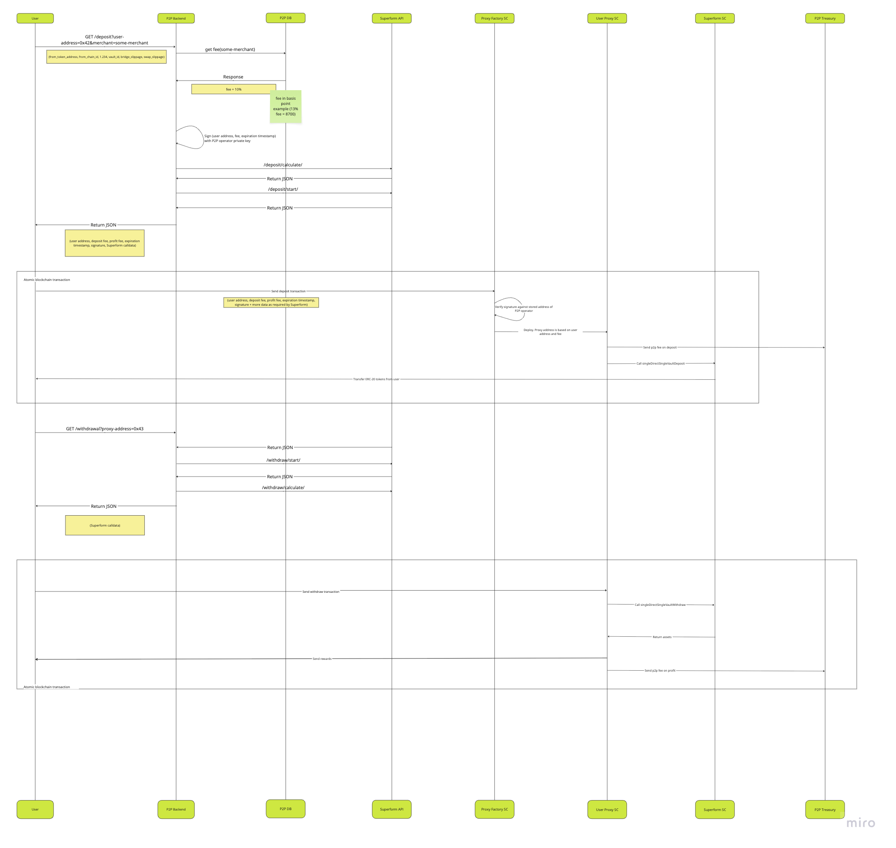

## p2p-yield-proxy

Contracts for depositing and withdrawing ERC-20 tokens from yield protocols.
The current implementation targets the [Resolv](https://resolv.im/) staking system (USR / RESOLV).

## Running tests

```shell
curl -L https://foundry.paradigm.xyz | bash
source /Users/$USER/.bashrc
foundryup
forge test
```

## Deployment

```shell
forge script script/Deploy.s.sol:Deploy --rpc-url $RPC_URL --private-key $PRIVATE_KEY --broadcast --chain $CHAIN_ID --json --verify --etherscan-api-key $ETHERSCAN_API_KEY -vvvvv
```

This script will:

- deploy and verify on Etherscan the **P2pResolvProxyFactory** and **P2pResolvProxy** contracts
- set the **P2pTreasury** address permanently in the P2pResolvProxyFactory
- register calldata rules for Resolv specific operations (`deposit`, `initiateWithdrawal`, `withdraw`, distributor `claim`).

## Basic use case



#### Resolv Deposit flow

See [test/RESOLVIntegration.sol](test/RESOLVIntegration.sol) for an end-to-end reference.

1. Website User (called Client in contracts) calls Backend with its (User's) Ethereum address and some Merchant info.

2. Backend uses Merchant info to determine the P2P fee (expressed as client basis points in the contracts).

3. Backend calls `P2pResolvProxyFactory::getHashForP2pSigner` to retrieve the message the signer must approve.

```solidity
    /// @dev Gets the hash for the P2pSigner
    /// @param _client The address of client
    /// @param _clientBasisPoints The client basis points
    /// @param _p2pSignerSigDeadline The P2pSigner signature deadline
    /// @return The hash for the P2pSigner
    function getHashForP2pSigner(
        address _client,
        uint96 _clientBasisPoints,
        uint256 _p2pSignerSigDeadline
    ) external view returns (bytes32);
```

4. Backend signs the hash with the P2pSigner's private key using `eth_sign`. Signing is necessary to authenticate the client basis points in the contracts.

5. Backend returns JSON to the User with (client address, client basis points, signature deadline, and the signature).

6. Client retrieves their deterministic proxy address from `P2pResolvProxyFactory::predictP2pYieldProxyAddress` and ensures any approvals required by the protocol (e.g. `approve` for RESOLV or Permit2 flow) are in place.

7. Client signs the factory configuration using the returned payload (examples use `eth_signTypedData_v4`).

8. Client calls `P2pResolvProxyFactory::deposit` with:

```solidity
    /// @notice Deposits a client supplied asset into the underlying yield protocol via a proxy.
    /// @param _asset Address of the ERC-20 asset to deposit on behalf of the client.
    /// @param _amount Amount of `_asset` to move from the client to the proxy and forward to the yield protocol.
    /// @param _clientBasisPoints Fee share expressed in basis points (out of 10_000) that the client keeps.
    /// @param _p2pSignerSigDeadline Expiration timestamp for the signer approval accompanying this deposit.
    /// @param _p2pSignerSignature Off-chain signature authorising the deposit parameters from the designated signer.
    /// @return p2pYieldProxyAddress Deterministic proxy address used for the client after the deposit is processed.
    function deposit(
        address _asset,
        uint256 _amount,
        uint96 _clientBasisPoints,
        uint256 _p2pSignerSigDeadline,
        bytes calldata _p2pSignerSignature
    )
    external
    returns (address p2pYieldProxyAddress);
```

Depending on `_asset`, the proxy will:
- forward USR deposits to the stUSR contract (`IStUSR.deposit`), or
- forward RESOLV to the staking contract (`IResolvStaking.deposit`).

#### Resolv Withdrawal flow

Two variations exist, matching the helper methods exposed on `P2pResolvProxy`.

**Direct client withdrawal (USR / RESOLV principal)**
1. Client signs a transaction calling `P2pResolvProxy::withdrawUSR` (or `withdrawAllUSR`) for USR positions, or `initiateWithdrawalRESOLV` followed later by `withdrawRESOLV` for RESOLV principal.
2. The proxy calculates accrued rewards, splits them according to `clientBasisPoints`, transfers the P2P share to treasury, and sends the client share to the user.

**P2P operator reward sweep**
1. P2P operator calls `initiateWithdrawalRESOLVAccruedRewards` to queue the proxy’s accrued rewards.
2. After the Resolv cooldown, the operator (or client) calls `withdrawRESOLV` to finalise the sweep; the proxy performs the same fee split as above.

#### Claiming distributor rewards

Both the client and P2P operator can claim airdropped/staked rewards that Resolv pushes via its distributor by calling:

```solidity
    /// @notice Claims rewards from the Resolv StakedTokenDistributor on behalf of the client/operator.
    /// @param _index Index of the Merkle proof entry.
    /// @param _amount Amount of rewards being claimed.
    /// @param _merkleProof Merkle proof validating the claim eligibility.
    function claimStakedTokenDistributor(
        uint256 _index,
        uint256 _amount,
        bytes32[] calldata _merkleProof
    )
    external;
```

### Key Resolv-specific helper methods (documented in `IP2pResolvProxy`)

- `withdrawUSR(uint256 _amount)` / `withdrawAllUSR()`
- `initiateWithdrawalRESOLV(uint256 _amount)`
- `initiateWithdrawalRESOLVAccruedRewards()`
- `withdrawRESOLV()`
- `claimStakedTokenDistributor(uint256 _index, uint256 _amount, bytes32[] calldata _merkleProof)`

Each method enforces caller access (client vs operator) as per the contract.

## Calling any function on any contract via P2pResolvProxy

The generic `callAnyFunction` hook from `P2pYieldProxy` remains. After configuring the `AllowedCalldataChecker` rules for the desired target and selector, clients can execute arbitrary calls through:

The rules should be as strict as possible to prevent any undesired function calls.

Once the rules are set, the User can call the permitted function on the permitted contract with the permitted calldata via P2pEthenaProxy's `callAnyFunction` function:

```solidity
    /// @notice Calls an arbitrary allowed function
    /// @param _yieldProtocolAddress The address of the yield protocol
    /// @param _yieldProtocolCalldata The calldata to call the yield protocol
    function callAnyFunction(
        address _yieldProtocolAddress,
        bytes calldata _yieldProtocolCalldata
    )
    external;
```
